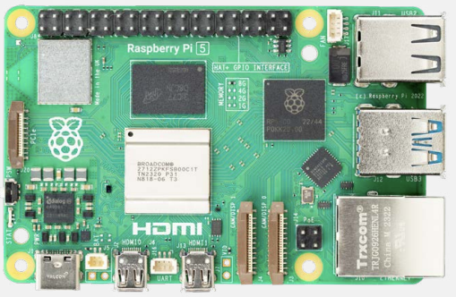
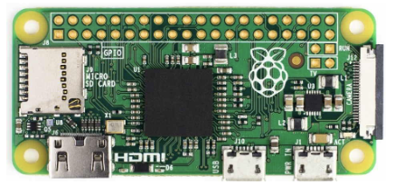
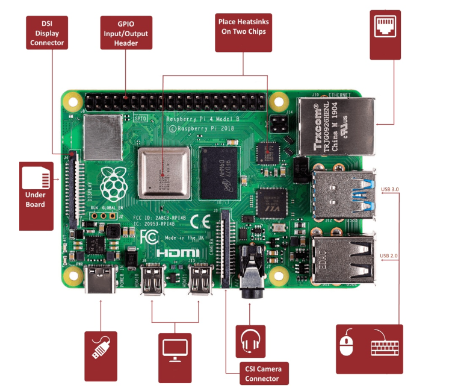

A typical computing system consists of hardware components, which have been carefully designed to effectively work together, and software components, also known as programs, that run in the system.

A simple theoretical overview and history of a computer, in general, is available at [Tech Target](https://www.techtarget.com/searchwindowsserver/definition/system).
 
- **Note**: For a brief review of how a computer system works, a simple computer architecture can be found in [Little Man Computer](https://www.101computing.net/LMC/#).

## Basic computing systems for robotics

A computing system is one of the integral aspects of robotics. It is well known that many complex computations take place in robotic system to provide the intelligent capability for this kind of system. For this reason, selecting the right computer is essential. 

However, due to the advancement in computing, there are various kinds of computers with enhanced capabilities. Therefore, choosing a good companion computer for a specific robot is not too challenging. 

As this module of SNI course focuses more on providing hands on experience, without a steep learning curve, a Raspberry Pi will be used as the main computer system. 

On the other hand, the operation of a companion computer is often complemented with a separate micro-controller, acting as a a hardware driver, for manipulating electromechanical systems. 

Based on the above philosophy, a quick overview of Raspberry Pi and Arduino will be provided in this part of the module.

### Brief overview of Raspberry Pi

Raspberry Pi is a small-sized and single-board computer. This type of computer can be transformed into a mini personal computer by connecting additional peripherals such as mouse, keyboard, display, etc.

Raspberry Pi is used a lot in robotics and IoT-based applications, where it provides an interface to connect various kinds of sensors.

Even though Raspberry Pi has most of the features and capabilities of desktop and laptop computers, it is slow in computational power at the expense of low power consumption.

#### Versions of Raspberry pi models
 
There are different models of raspberry pi available as follows:

- Raspberry Pi 5.
- Raspberry Pi 4 Model B.
- Raspberry Pi 3 Model B+
- Raspberry Pi 3 Model A+
- Raspberry Pi 3 Model B.
- Raspberry Pi 2 Model B.
- Raspberry Pi 1 Model B+
- Raspberry Pi 1 Model A+

- Raspberry Pi Zero

#### Operating system for Raspberry Pi

Raspberry Pi has a foundation that officially provides us with Debian-based Raspbian OS.

However, we can install various Third-Party OS on this computer like Ubuntu, Archlinux, RISC OS, Windows 10 IOT Core, etc. 

Note: Raspbian OS is a free and officially optimized OS available for this type of computer. 

The OS has GUI which includes many tools for browsing, programming, games, etc. 

Another advantage of Raspbian OS, it provides access to the on-chip hardware i.e., GPIOs for other devices. 

#### Raspberry pi processor

It has an ARM-based Broadcom Processor SoC alongside an on-chip GPU (Graphics Processing Unit).

The CPU speed of Raspberry Pi varies from 700 MHz to 2.4 GHz.

#### Raspberry pi hardware configuration

A standard hardware configuration of Raspberry Pi is shown in the figure below:

Some of the typical hardware components from the figure above include:

- HDMI (High-Definition Multimedia Interface)
- CSI Camera Interface: CSI (Camera Serial Interface)
- DSI Display Interface: DSI (Display Serial Interface)
- Composite Video and Audio Output
- Power LED
- ACT PWR

### Quick overview of Arduino