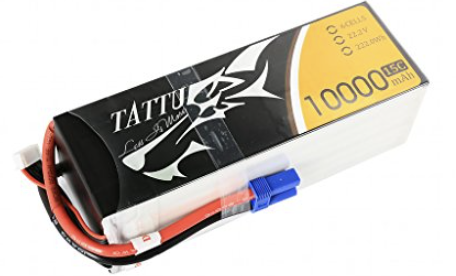
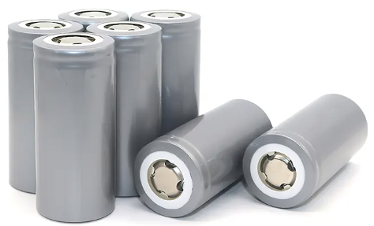

Almost all kind of robots requires power, typically electrical, for its components to function. 

The electrical components of the robot (called sensors) acquire data from the operating environment and send it to the computer system, which outputs the required power to drive the robots' actuating systems.

In other words, the power system can be considered approximately as the robot’s nervous system.

The electrical power consumed by the robot depends heavily on requirements from its electrical components, such as motor voltage, current draw, sensors necessary for an intelligent control system, size and weight restrictions, etc. 

### Major system requiring power in robot

There are two integral parts of the robot requiring power which includes:

- Propulsion system, which mostly needs a 12- 30V battery and a significant current draw. 
  It is worth noting that this draws power only when the robot is pressurizing its actuating system.

- The second system, which comprises the microcontroller and sensors, requires 5V.

Based on the above two integral parts, robot manufacturers often select batteries as the main power source; 
this is due to the following reasons:

1. contains dense energy 
2. rechargeable 
3. stable for long-term 
4. non-combustible
5. environmentally friendly 

The following batteries approximately fit into these criteria: 

### Lithium Polymer (LiPo) 
An example of a LiPo battery is shown below:

Good energy density, commercially available, lightweight, long life, environmentally friendly, safer compared to conventional lead-acid batteries, etc.

On the other hand, LiPo batteries are not perfectly charge stable and may produce voltage fluctuations. 

### Lithium Iron Phosphate (LiFePo4)

This type of battery, depicted below, sometimes have better performance than LiPo.

Pose no risk to safety, environment friendly, high energy density, etc.

However, LiFePo4 has a small life span (≈ 3 years) after its production. 