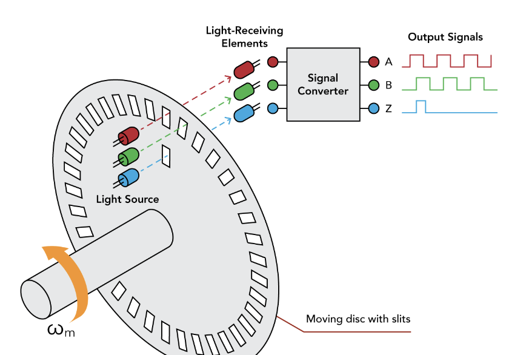
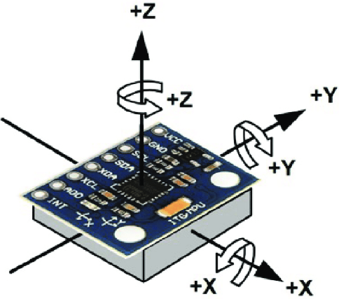

A sensor is any device that detects changes in the environment; it sends this information to the computing system for processing.

Thus, helping robots to perceive their operating environment, make decisions, and interact with the physical world.

### Sensors use in robotics 

Different sensing devices exist to acquire specific information from the surrounding environment.

These devices can be categorized based on the data they capture.

### Internal sensors

These sensors are generally used to monitor the  internal state of a robot, such as position, velocity, and orientation. For instance,

- Encoder (optical, magnetic): measures rotational position or motion (used in wheels, joints).

- Gyroscope: gives the robot's angular velocity to maintain balance.

- Accelerometer: measures linear acceleration to detect motion or orientation.

### External sensors

This category of sensors is mostly deployed to interact with/perceive the environment. For example,

- Proximity (infrared IR, ultrasonic ) sensor: detects the presence of nearby objects.

- Distance (laser rangefinder LIDAR, sonar) sensor: measures the distance from the robot to an object.

- Camera (RGB, depth): provides visual information to the robot for object detection, navigation, or manipulation.

- Touch sensor: detects physical contact or pressure on surfaces (e.g., for gripping or collision detection).

- Force/Torque sensors: measure the amount of force and torque applied by or on the robot’s actuators, commonly installed in robotic arms.

### Applications

- Localization and mapping: LIDAR and cameras enable robots to create maps of their surroundings (SLAM - Simultaneous Localization and Mapping).

- Obstacle avoidance: proximity and distance sensors help robots avoid obstacles in real-time.

- Object recognition and manipulation: cameras and touch sensors allow robots to detect, identify, and manipulate objects.

- Navigation: GPS, along with other sensors like gyroscopes and accelerometers, allows robots to move from one point to another.

- Human-robot interaction: sensors like cameras and microphones enable robots to interact with humans, recognizing gestures, voice commands, and facial expressions.

### Challenges with Sensors
- Noise: sensor data can be noisy and inaccurate, requiring filtering techniques like Kalman filters to improve data quality.

- Cost and power consumption: high-grade sensors can be expensive, and some require significant power.

- Data processing: real-time processing of sensor data can be computationally intensive, necessitating advanced algorithms.

### Sensor fusion

Combining data from multiple sensors to achieve a more accurate understanding of the environment.

Example,  a robot may use both a camera and LIDAR to get better object detection and depth perception.

### Future perspective

1. Advanced vision systems: increased use of AI-driven image recognition and deep learning for robots to understand and interpret visual data.

2. Sophisticated haptic sensors: enabling robots to "feel" with greater accuracy and adapt to various touch-based tasks.

3. Autonomous sensor development: sensors that can self-calibrate or adapt to changing environments, reducing the need for manual adjustments.

