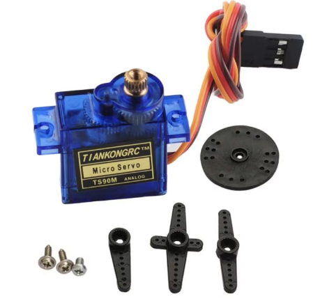

Servos (also known as servo motors) are special motors providing high precision control over linear/angular position, velocity, and acceleration. 

They are essential components in robotic systems for controlled movements. A typical servo motor used by hobbyists and students is shown below.

### Components of servos
- Motor: DC motor that generates rotational force.
- Feedback sensor: potentiometer/encoder for measuring the current position.
- Control circuit: adjust the motor's position based on the control signals received and process feedback 

### Basic principle of operation
Servos are controlled using Pulse Width Modulation (PWM). A PWM signal consists of pulses of varying width, where the width of the pulse determines the desired position of the servo.

For instance: a pulse width of 1.5 milliseconds typically positions the servo at its center (90°), while shorter and longer pulses move it to the left and right, respectively.

Servos use a closed-loop control system with a feedback sensor, which continuously monitors the output position. 
When the actual position of the servo deviates from the desired position, the control circuit adjusts the motor until the desired position is reached.

Servos often have a limited range of motion with standard ones operating from 0° to 180°.
On the other hand, continuous rotation servos can rotate indefinitely in either direction but lack precise positioning capabilities. Hence not suitable for applications requiring precise angles rather than speed and direction.

### Common types of servos

Positional rotation servo: rotate to a specific angle and hold that position.
It is widely used in robotic arms, model airplanes, and RC cars where precise positioning is needed.

Continuous rotation servo: rotate continuously in one direction or the other; It is often used in mobile robots and wheeled vehicles for driving or spinning actions.

Linear servos: convert rotational motion into linear movement for push or pull actions, such as robotic grippers or drawer slides.

### Key features

- Precision: servos provide high accuracy, with positional control often down to fractions of a degree, making them ideal for high-precision applications.
- Torque: the rating of a servo determines its ability to move loads. Higher torque is essential for lifting heavier objects or overcoming resistance.
- Torque measurement: measured in Newton-meters (N·m)/ounce-inches (oz-in).

### Applications of servos in Robotics

1. Robotic arms: control joints for accurate positioning of end effectors (e.g., grippers, tools) in tasks such as assembly, welding, or painting.

2. Wheeled robots: utilize servos for steering mechanisms or controlling wheel rotation, enabling navigation and movement.

3. Humanoid robots: employ servos to simulate human movement, allowing for actions such as walking, grasping, and facial expressions.

4. Drones: control flight surfaces like ailerons and rudders to ensure stable flight and maneuverability, etc.

### Advantages of servos
- Size: servos are generally small and lightweight, making them suitable for space-constrained applications.

- Precision and speed: offer rapid and precise movements, which are essential in dynamic environments and tasks requiring quick adjustments.

- Ease of Use: most servos are easy to integrate with microcontrollers and development platforms, making them user friendly for hobbyists, students, engineers, etc.

### Some common limitations
- Limited range: positional servos typically have a 180° range, which may not be sufficient for some applications. Continuous rotation servos lack positional feedback, making precise control impossible.

- Cost: while basic servos are affordable, high-torque or high-precision servos can be costly, impacting budget considerations in larger projects.

- Power consumption: Servos require a continuous power supply while engaged, which may be a concern in battery-powered applications.